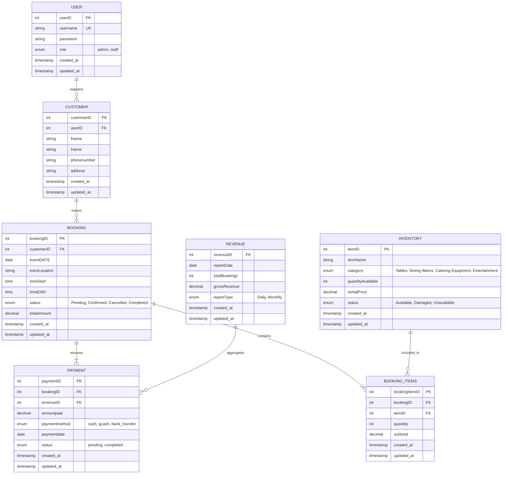

# Minjee Balloon - Database Entity Relationship Diagram

## ER Diagram

## Relationships

### 1. USER to CUSTOMER (One-to-Many)
- **Description**: A staff member or admin (User) can register multiple Customers
- **Implementation**: `userID` foreign key in CUSTOMER table
- **Cascade**: ON DELETE SET NULL (preserves customer data if user is deleted)

### 2. CUSTOMER to BOOKING (One-to-Many)
- **Description**: One customer can have multiple event bookings over time
- **Implementation**: `customerID` foreign key in BOOKING table
- **Cascade**: ON DELETE CASCADE (deletes bookings when customer is deleted)

### 3. BOOKING to BOOKING_ITEMS (One-to-Many)
- **Description**: Each booking can contain multiple specific rental items (e.g., 10 chairs, 2 tables)
- **Implementation**: `bookingID` foreign key in BOOKING_ITEMS table
- **Cascade**: ON DELETE CASCADE (deletes items when booking is deleted)

### 4. INVENTORY to BOOKING_ITEMS (One-to-Many)
- **Description**: A specific inventory item can be part of many different bookings
- **Implementation**: `itemID` foreign key in BOOKING_ITEMS table
- **Cascade**: ON DELETE RESTRICT (prevents deletion of inventory in use)

### 5. BOOKING to PAYMENT (One-to-Many)
- **Description**: Accommodates "Partial" and "Full" payment stages for a booking
- **Implementation**: `bookingID` foreign key in PAYMENT table
- **Cascade**: ON DELETE CASCADE (deletes payments when booking is deleted)

### 6. REVENUE to PAYMENT (One-to-Many / Many-to-One from Payment perspective)
- **Description**: All payments for a specific date are aggregated into a single Revenue report entry
- **Implementation**: `revenueID` foreign key in PAYMENT table
- **Cascade**: ON DELETE SET NULL (preserves payment data if revenue report is deleted)

## Table Specifications

### USER
Stores system users (admin and staff) who can access the management system.

| Field | Data Type | Constraints | Description | Example |
|-------|-----------|-------------|-------------|---------|
| userID | INT | PK, AI | Unique identifier for each user | 1 |
| username | VARCHAR(255) | NOT NULL, UK | Unique login username | admin |
| password | VARCHAR(255) | NOT NULL | Hashed password | $2y$10$... |
| role | ENUM | NOT NULL | User role (admin, staff) | admin |
| created_at | TIMESTAMP | DEFAULT CURRENT_TIMESTAMP | Account creation date | 2026-01-15 09:30:00 |
| updated_at | TIMESTAMP | DEFAULT CURRENT_TIMESTAMP | Last update | 2026-02-25 14:20:00 |

---

### CUSTOMER
Stores customer profile information and contact details.

| Field | Data Type | Constraints | Description | Example |
|-------|-----------|-------------|-------------|---------|
| customerID | INT | PK, AI | Unique identifier for each customer | 101 |
| userID | INT | FK, NULL | User who registered this customer | 1 |
| fname | VARCHAR(100) | NOT NULL | Customer's first name | John |
| lname | VARCHAR(100) | NOT NULL | Customer's last name | Doe |
| phonenumber | VARCHAR(20) | NOT NULL | Contact phone number | 09171234567 |
| address | VARCHAR(200) | NOT NULL | Complete address | 123 Main St, Davao |
| created_at | TIMESTAMP | DEFAULT CURRENT_TIMESTAMP | Account creation date | 2026-01-15 09:30:00 |
| updated_at | TIMESTAMP | DEFAULT CURRENT_TIMESTAMP | Last profile update | 2026-02-25 14:20:00 |

---

### BOOKING
Stores event booking details and reservation information.

| Field | Data Type | Constraints | Description | Example |
|-------|-----------|-------------|-------------|---------|
| bookingID | INT | PK, AI | Unique identifier for each booking | 5001 |
| customerID | INT | FK | Links booking to a customer | 101 |
| eventDATE | DATE | NOT NULL | Date of the scheduled event | 2026-03-10 |
| evenLocation | VARCHAR(150) | NOT NULL | Venue or event location | Davao Convention Center |
| timeStart | TIME | NOT NULL | Event start time | 14:00:00 |
| timeEND | TIME | NOT NULL | Event end time | 18:00:00 |
| status | ENUM | DEFAULT 'Pending' | Pending, Confirmed, Cancelled, Completed | Confirmed |
| totalAmount | DECIMAL(10,2) | NOT NULL | Total rental amount for the booking | 8500.00 |
| created_at | TIMESTAMP | DEFAULT CURRENT_TIMESTAMP | Date and time booking was created | 2026-02-22 \| 11:00:00 |
| updated_at | TIMESTAMP | DEFAULT CURRENT_TIMESTAMP | Date and time booking was updated | 2026-02-25 \| 12:30:00 |

---

### PAYMENT
Tracks all payments made for bookings, including partial and full payments.

| Field | Data Type | Constraints | Description | Example |
|-------|-----------|-------------|-------------|---------|
| paymentID | INT | PK, AI | Unique identifier for each payment transaction | 9001 |
| bookingID | INT | FK | Links payment to a booking | 5001 |
| amountPaid | DECIMAL(10,2) | NOT NULL | Amount paid by customer | 3000.00 |
| paymentMethod | ENUM | NOT NULL | Cash, GCash, Bank Transfer | GCash |
| referenceNumber | VARCHAR(100) | NULL | Transaction reference number (for digital payments) | GCash – 98374623 |
| paymentDATE | TIMESTAMP | DEFAULT CURRENT_TIMESTAMP | Date and time payment was recorded | 2026-02-22 \| 14:00:00 |
| status | ENUM | NOT NULL | Partial, Full, Refunded | Partial |

---

### INVENTORY
Stores rental items available for booking and tracks their availability.

| Field | Data Type | Constraints | Description | Example |
|-------|-----------|-------------|-------------|---------|
| itemID | INT | PK, AI | Unique identifier for each rental item | 201 |
| itemName | VARCHAR(100) | NOT NULL | Name of rental item | Round Table |
| category | ENUM | NOT NULL | Tables, Dining Wares, Catering Equipment, Entertainment | Tables |
| quantityAvailable | INT | NOT NULL | Total available quantity in stock | 50 |
| rentalPrice | DECIMAL(10,2) | NOT NULL | Rental price per unit | 200.00 |
| status | ENUM | DEFAULT 'Available' | Available, Damaged, Unavailable | Available |

---

### BOOKING_ITEMS
Links bookings to specific rental items and stores quantity and subtotal per item.

| Field | Data Type | Constraints | Description | Example |
|-------|-----------|-------------|-------------|---------|
| bookingItemID | INT | PK, AI | Unique identifier for each booking item record | 1 |
| bookingID | INT | FK | Links to a specific booking | 5001 |
| itemID | INT | FK | Links to an inventory item | 201 |
| quantity | INT | NOT NULL | Number of items rented | 10 |
| subtotal | DECIMAL(10,2) | NOT NULL | Total price for this item (quantity × rentalPrice) | 1500.00 |

---

### REVENUE
Stores summarized financial data to provide management with visibility into revenue trends and performance.

| Field | Data Type | Constraints | Description | Example |
|-------|-----------|-------------|-------------|---------|
| revenueID | INT | PK, AI | Unique identifier for the revenue summary record | 1 |
| reportDate | DATE | NOT NULL, UK | The specific date the revenue summary covers | 2026-02-24 |
| totalBookings | INT | NOT NULL | Total number of bookings confirmed or completed on this date | 8 |
| grossRevenue | DECIMAL(10,2) | NOT NULL | Total accumulated payments received for the day | 15500.00 |
| reportType | ENUM | NOT NULL | Daily, Weekly, Monthly | Daily |
| created_at | TIMESTAMP | DEFAULT CURRENT_TIMESTAMP | Date and time the summary was generated | 2026-02-24 \| 23:59:00 |
| updated_at | TIMESTAMP | DEFAULT CURRENT_TIMESTAMP | Date and time the record was updated | 2026-02-25 \| 12:30:00 |

---

## Key Relationships

| Parent | Child | Type | Description |
|--------|-------|------|-------------|
| CUSTOMER | BOOKING | 1:N | A customer can make multiple bookings |
| BOOKING | PAYMENT | 1:N | A booking can receive multiple payments (partial payments) |
| BOOKING | BOOKING_ITEMS | 1:N | A booking can contain multiple rental items |
| INVENTORY | BOOKING_ITEMS | 1:N | An inventory item can be included in multiple bookings |
| BOOKING | REVENUE | 1:1 | A booking contributes to revenue reporting |

---

## Database Design Notes

### Normalization
- All tables are in 3NF (Third Normal Form)
- Foreign keys establish referential integrity
- Each table has a primary key (surrogate key using AUTO_INCREMENT)
- Unique constraints prevent duplicate entries where applicable

### Data Integrity
- ENUM fields ensure data consistency for statuses and categories
- DECIMAL type used for monetary values to avoid floating-point precision issues
- TIMESTAMP fields auto-update for audit trails
- Foreign keys enforce referential integrity

### Query Patterns
- Booking summary with customer details: JOIN CUSTOMER → BOOKING
- Payment tracking for a booking: JOIN BOOKING → PAYMENT
- Booking details with items: JOIN BOOKING → BOOKING_ITEMS → INVENTORY
- Revenue analysis: JOIN BOOKING → REVENUE by reportType
- Inventory availability: Query INVENTORY table with quantityAvailable filter

---

## Future Enhancements
- Add User authentication table for admin/staff management
- Add ServiceLog table for tracking equipment maintenance
- Add ReviewRating table for customer feedback
- Add UserRole/Permission tables for RBAC
- Add Discount/Promo table for promotional campaigns
